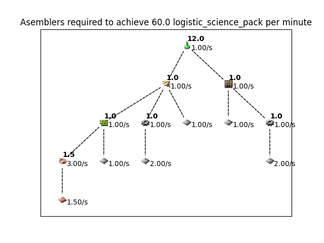

# Factorio Resource Calculator

This repository contains a few scripts for calculating the number of assembling machines required to make items at a particular throughput.

## What does it do?

Using a script called `amg.py` (assembler machine tree), you can view the tree of assembling dependencies required to make an item at a particular rate. For example, to make green science at 60 SPM, run 
```bash
./amg.py logistic_science_pack
```


## Installation on Linux

Make sure python (>= 3.9), graphviz and Qt are installed is installed: 
For pop-os 22.04 jammy,
```bash 
sudo apt install python3 python3-venv python3-pip graphviz libgraphviz-dev
```

If it doesn't work you need to add `qt5base-dev`, which you can do with this command:
```bash
sudo apt install qt5base-dev
```
and clone this repository. From the root directory, make a virtual environment and install the requirements as follows:

```bash
python3 -m venv venv
source venv/bin/activate
pip install -r requirements.txt
```

Or if you don't wanna do venv you can just run
```bash
pip install -r requirements.txt
```

After that, you can run use `./amg.py`, which shows the assembling machine dependency tree required to make an item at a certain rate. Run 
```bash
./amg.py -h
``` 
to read how it works.

To run the tests, install pytest using `pip install pytest`. Then run `pytest`.

## Installation on Windows and Mac

First, wipe your hard drive and install GNU/Linux. Then proceed to follow the instructions in the previous section.

Joking aside, you can probably get it working on Mac or Windows, but it hasn't been tested. The virtual environment should "just work", provided the python version is high enough, but graphviz and qt5 might require separate installation. Mac will probably work with some kind of brew install graphviz, and otherwise the same instructions as Linux above.

# Reading the ods without a GUI
This command produces a csv version, `factorio_recipes.csv`:
```bash
libreoffice --headless --convert-to csv factorio_recipes.ods
```

# TODO 

- Add text output for summary
- Add ceil to assembling machines 
- Or minimal perfect ratio
- Add interactive prompt (repl)
- Add fluid recipes 

